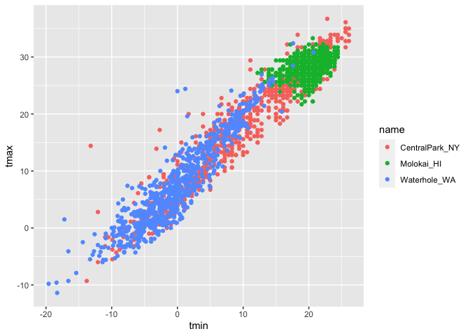

Data Visualization I
================

``` r
library(tidyverse)
```

    ## ── Attaching core tidyverse packages ──────────────────────── tidyverse 2.0.0 ──
    ## ✔ dplyr     1.1.3     ✔ readr     2.1.4
    ## ✔ forcats   1.0.0     ✔ stringr   1.5.0
    ## ✔ ggplot2   3.4.3     ✔ tibble    3.2.1
    ## ✔ lubridate 1.9.2     ✔ tidyr     1.3.0
    ## ✔ purrr     1.0.2     
    ## ── Conflicts ────────────────────────────────────────── tidyverse_conflicts() ──
    ## ✖ dplyr::filter() masks stats::filter()
    ## ✖ dplyr::lag()    masks stats::lag()
    ## ℹ Use the conflicted package (<http://conflicted.r-lib.org/>) to force all conflicts to become errors

``` r
library(ggridges)
```

## Loading data

``` r
weather_df = 
  rnoaa::meteo_pull_monitors(
    c("USW00094728", "USW00022534", "USS0023B17S"),
    var = c("PRCP", "TMIN", "TMAX"), 
    date_min = "2021-01-01",
    date_max = "2022-12-31") |>
  mutate(
    name = recode(
      id, 
      USW00094728 = "CentralPark_NY", 
      USW00022534 = "Molokai_HI",
      USS0023B17S = "Waterhole_WA"),
    tmin = tmin / 10,
    tmax = tmax / 10) |>
  select(name, id, everything())
```

    ## using cached file: /Users/cjd2195/Library/Caches/org.R-project.R/R/rnoaa/noaa_ghcnd/USW00094728.dly

    ## date created (size, mb): 2023-10-05 10:29:35.021583 (8.527)

    ## file min/max dates: 1869-01-01 / 2023-10-31

    ## using cached file: /Users/cjd2195/Library/Caches/org.R-project.R/R/rnoaa/noaa_ghcnd/USW00022534.dly

    ## date created (size, mb): 2023-10-05 10:29:43.72746 (3.832)

    ## file min/max dates: 1949-10-01 / 2023-10-31

    ## using cached file: /Users/cjd2195/Library/Caches/org.R-project.R/R/rnoaa/noaa_ghcnd/USS0023B17S.dly

    ## date created (size, mb): 2023-10-05 10:29:46.685904 (0.997)

    ## file min/max dates: 1999-09-01 / 2023-10-31

``` r
weather_df
```

    ## # A tibble: 2,190 × 6
    ##    name           id          date        prcp  tmax  tmin
    ##    <chr>          <chr>       <date>     <dbl> <dbl> <dbl>
    ##  1 CentralPark_NY USW00094728 2021-01-01   157   4.4   0.6
    ##  2 CentralPark_NY USW00094728 2021-01-02    13  10.6   2.2
    ##  3 CentralPark_NY USW00094728 2021-01-03    56   3.3   1.1
    ##  4 CentralPark_NY USW00094728 2021-01-04     5   6.1   1.7
    ##  5 CentralPark_NY USW00094728 2021-01-05     0   5.6   2.2
    ##  6 CentralPark_NY USW00094728 2021-01-06     0   5     1.1
    ##  7 CentralPark_NY USW00094728 2021-01-07     0   5    -1  
    ##  8 CentralPark_NY USW00094728 2021-01-08     0   2.8  -2.7
    ##  9 CentralPark_NY USW00094728 2021-01-09     0   2.8  -4.3
    ## 10 CentralPark_NY USW00094728 2021-01-10     0   5    -1.6
    ## # ℹ 2,180 more rows

## Basic Scatterplot

``` r
ggplot(weather_df, aes(x = tmin, y = tmax))
```

<!-- -->

It’s blank! Because we haven’t added any geoms.

``` r
ggplot(weather_df, aes(x = tmin, y = tmax)) +
  geom_point()
```

    ## Warning: Removed 17 rows containing missing values (`geom_point()`).

<!-- -->

This code would accomplish the same thing:

``` r
weather_df |>
  ggplot(aes(x = tmin, y = tmax)) + 
  geom_point()
```

This plot is helpful, kind of, but not as informative as we might want.
So let’s add another dimension: color!

``` r
ggplot(weather_df, aes(x = tmin, y = tmax)) + 
  geom_point(aes(color = name))
```

    ## Warning: Removed 17 rows containing missing values (`geom_point()`).

<!-- -->

Let’s continue to build on that by making the points a bit more
transparent, and by adding a line:

``` r
ggplot(weather_df, aes(x = tmin, y = tmax)) + 
  geom_point(aes(color = name), alpha = .5) +
  geom_smooth(se = FALSE)
```

    ## `geom_smooth()` using method = 'gam' and formula = 'y ~ s(x, bs = "cs")'

    ## Warning: Removed 17 rows containing non-finite values (`stat_smooth()`).

    ## Warning: Removed 17 rows containing missing values (`geom_point()`).

<!-- -->

From the class webpage:

Neat! The curve gives a sense of the relationship between variables, and
the transparency shows where data are overlapping. I can’t help but
notice, though, that the smooth curve is for all the data but the colors
are only for the scatterplot. Turns out that this is due to where I
defined the mappings. The X and Y mappings apply to the whole graphic,
but color is currently geom-specific. Sometimes you want or need to do
this, but for now I don’t like it. If I’m honest, I’m also having a hard
time seeing everything on one plot, so I’m going to add facet based on
name as well.

``` r
ggplot(weather_df, aes(x = tmin, y = tmax, color = name)) + 
  geom_point(alpha = .5) +
  geom_smooth(se = FALSE) + 
  facet_grid(. ~ name)
```

    ## `geom_smooth()` using method = 'loess' and formula = 'y ~ x'

    ## Warning: Removed 17 rows containing non-finite values (`stat_smooth()`).

    ## Warning: Removed 17 rows containing missing values (`geom_point()`).

<!-- -->

Cool! Let’s try another graph to investigate the time of year:

``` r
ggplot(weather_df, aes(x = date, y = tmax, color = name)) + 
  geom_point(aes(size = prcp), alpha = .5) +
  geom_smooth(se = FALSE) + 
  facet_grid(. ~ name)
```

    ## `geom_smooth()` using method = 'loess' and formula = 'y ~ x'

    ## Warning: Removed 17 rows containing non-finite values (`stat_smooth()`).

    ## Warning: Removed 19 rows containing missing values (`geom_point()`).

<!-- -->

### Learning assessment

``` r
weather_df |> 
  filter(name == "CentralPark_NY") |> 
  mutate(tmax_f = 
           (tmax * (9/5)) + 32
         ) |> 
  mutate(tmin_f = 
           (tmin * (9/5)) + 32
         ) |> 
  ggplot(aes(x = tmin_f, y = tmax_f)) + 
  geom_point(alpha = 0.5) +
  geom_smooth(method = "lm", se = FALSE)
```

    ## `geom_smooth()` using formula = 'y ~ x'

<!-- -->

## More plotting!

``` r
ggplot(weather_df, aes(x = date, y = tmax, color = name)) + 
  geom_smooth(se = FALSE) 
```

    ## `geom_smooth()` using method = 'loess' and formula = 'y ~ x'

    ## Warning: Removed 17 rows containing non-finite values (`stat_smooth()`).

<!-- -->

Back to scatterplots: sometimes, you can only control for overlapping
using transparency (alpha) so much before it still isn’t sufficient.
There are some other methods to help with that!

``` r
ggplot(weather_df, aes(x = tmax, y = tmin)) + 
  geom_hex()
```

    ## Warning: Removed 17 rows containing non-finite values (`stat_binhex()`).

<!-- -->

## Aesthetics

There are lots of aesthetics! The help page for each individual geom
will tell you which are available- some (color) apply to all the geoms,
while others (shape) apply to only some geoms.

### Learning assessment

WHy don’t these two lines of code produce the same graphs?

``` r
ggplot(weather_df) + geom_point(aes(x = tmax, y = tmin), color = "blue")
```

    ## Warning: Removed 17 rows containing missing values (`geom_point()`).

<!-- -->

``` r
ggplot(weather_df) + geom_point(aes(x = tmax, y = tmin, color = "blue"))
```

    ## Warning: Removed 17 rows containing missing values (`geom_point()`).

<!-- -->

It has to do with where the color was specified! In the first graph
(which is probably what we were aiming to do), we specified color “by
hand” in geom_point, which told us what color all the points should be.
In the second graph, we specified it as an aesthetic mapping, so it
understood “blue” as a category it should map all the points to, and
then used the default color scheme to actually color the points.

## Univariate plots

``` r
ggplot(weather_df, aes(x = tmax)) + 
  geom_histogram()
```

    ## `stat_bin()` using `bins = 30`. Pick better value with `binwidth`.

    ## Warning: Removed 17 rows containing non-finite values (`stat_bin()`).

<!-- -->

We can look at some new aesthetics and mappings:

``` r
ggplot(weather_df, aes(x = tmax, fill = name)) + 
  geom_histogram(position = "dodge", binwidth = 2)
```

    ## Warning: Removed 17 rows containing non-finite values (`stat_bin()`).

<!-- -->

Density plots can be used in place of histograms.

``` r
ggplot(weather_df, aes(x = tmax, fill = name)) + 
  geom_density(alpha = .4, adjust = .5, color = "blue")
```

    ## Warning: Removed 17 rows containing non-finite values (`stat_density()`).

<!-- -->

From the course website: The adjust parameter in density plots is
similar to the binwidth parameter in histograms, and it helps to try a
few values. I set the transparency level to .4 to make sure all
densities appear. You should also note the distinction between fill and
color aesthetics here. You could facet by name as above but would have
to ask if that makes comparisons easier or harder. Lastly, adding
geom_rug() to a density plot can be a helpful way to show the raw data
in addition to the density.

Histograms and densities are one way of investigating univariate
distributions; boxplots are another.

``` r
ggplot(weather_df, aes(x = name, y = tmax)) + geom_boxplot()
```

    ## Warning: Removed 17 rows containing non-finite values (`stat_boxplot()`).

<!-- -->

There are also violin plots!

``` r
ggplot(weather_df, aes(x = name, y = tmax)) + 
  geom_violin(aes(fill = name), alpha = .5) + 
  stat_summary(fun = "median", color = "blue")
```

    ## Warning: Removed 17 rows containing non-finite values (`stat_ydensity()`).

    ## Warning: Removed 17 rows containing non-finite values (`stat_summary()`).

    ## Warning: Removed 3 rows containing missing values (`geom_segment()`).

<!-- -->

Another type of plot that’s good to use if you want to visually see the
distributions of individual variables is the ridge plot.

``` r
ggplot(weather_df, aes(x = tmax, y = name)) + 
  geom_density_ridges(scale = .85)
```

    ## Picking joint bandwidth of 1.54

    ## Warning: Removed 17 rows containing non-finite values
    ## (`stat_density_ridges()`).

<!-- -->

### Learning assessment

``` r
ggplot(weather_df, aes(x = prcp, fill = name)) +
  geom_histogram(position = "dodge", binwidth = 2)
```

    ## Warning: Removed 15 rows containing non-finite values (`stat_bin()`).

<!-- -->

``` r
ggplot(weather_df, aes(x = prcp, fill = name)) + 
  geom_density(alpha = .4, adjust = .5, color = "blue")
```

    ## Warning: Removed 15 rows containing non-finite values (`stat_density()`).

<!-- -->

``` r
ggplot(weather_df, aes(x = name, y = prcp)) + geom_boxplot()
```

    ## Warning: Removed 15 rows containing non-finite values (`stat_boxplot()`).

<!-- -->

``` r
ggplot(weather_df, aes(x = name, y = prcp)) + 
  geom_violin(aes(fill = name), alpha = .5) + 
  stat_summary(fun = "median", color = "blue")
```

    ## Warning: Removed 15 rows containing non-finite values (`stat_ydensity()`).

    ## Warning: Removed 15 rows containing non-finite values (`stat_summary()`).

    ## Warning: Removed 3 rows containing missing values (`geom_segment()`).

<!-- -->

``` r
ggplot(weather_df, aes(x = prcp, y = name)) + 
  geom_density_ridges(scale = .85)
```

    ## Picking joint bandwidth of 9.22

    ## Warning: Removed 15 rows containing non-finite values
    ## (`stat_density_ridges()`).

<!-- -->

# Saving plots!

NEVER USE THE EXPORT BUTTON. ggsave keeps things reproducible!!

``` r
ggp_weather = 
  ggplot(weather_df, aes(x = tmin, y = tmax)) + 
  geom_point(aes(color = name), alpha = .5) 

ggsave("ggp_weather.pdf", ggp_weather, width = 8, height = 5)
```

    ## Warning: Removed 17 rows containing missing values (`geom_point()`).

From the website:

Embedding plots in an R Markdown document can also take a while to get
used to, because there are several things to adjust. First is the size
of the figure created by R, which is controlled using two of the three
chunk options fig.width, fig.height, and fig.asp. I prefer a common
width and plots that are a little wider than they are tall, so I set
options to fig.width = 6 and fig.asp = .6. Second is the size of the
figure inserted into your document, which is controlled using out.width
or out.height. I like to have a little padding around the sides of my
figures, so I set out.width = “90%”. I do all this by including the
following in a code snippet at the outset of my R Markdown documents.

``` r
knitr::opts_chunk$set(
  fig.width = 6,
  fig.asp = .6,
  out.width = "90%"
)
```
