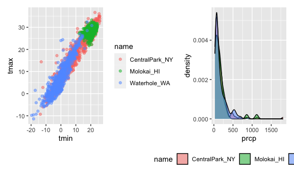

Data Visualization II
================

``` r
knitr::opts_chunk$set(
  fig.width = 6,
  fig.asp = .6,
  out.width = "90%"
)

library(tidyverse)
```

    ## ── Attaching core tidyverse packages ──────────────────────── tidyverse 2.0.0 ──
    ## ✔ dplyr     1.1.3     ✔ readr     2.1.4
    ## ✔ forcats   1.0.0     ✔ stringr   1.5.0
    ## ✔ ggplot2   3.4.3     ✔ tibble    3.2.1
    ## ✔ lubridate 1.9.2     ✔ tidyr     1.3.0
    ## ✔ purrr     1.0.2     
    ## ── Conflicts ────────────────────────────────────────── tidyverse_conflicts() ──
    ## ✖ dplyr::filter() masks stats::filter()
    ## ✖ dplyr::lag()    masks stats::lag()
    ## ℹ Use the conflicted package (<http://conflicted.r-lib.org/>) to force all conflicts to become errors

``` r
library(patchwork)
```

## Loading data

``` r
weather_df = 
  rnoaa::meteo_pull_monitors(
    c("USW00094728", "USW00022534", "USS0023B17S"),
    var = c("PRCP", "TMIN", "TMAX"), 
    date_min = "2021-01-01",
    date_max = "2022-12-31") |>
  mutate(
    name = recode(
      id, 
      USW00094728 = "CentralPark_NY", 
      USW00022534 = "Molokai_HI",
      USS0023B17S = "Waterhole_WA"),
    tmin = tmin / 10,
    tmax = tmax / 10) |>
  select(name, id, everything())
```

    ## using cached file: /Users/cjd2195/Library/Caches/org.R-project.R/R/rnoaa/noaa_ghcnd/USW00094728.dly

    ## date created (size, mb): 2023-10-05 10:29:35.021583 (8.527)

    ## file min/max dates: 1869-01-01 / 2023-10-31

    ## using cached file: /Users/cjd2195/Library/Caches/org.R-project.R/R/rnoaa/noaa_ghcnd/USW00022534.dly

    ## date created (size, mb): 2023-10-05 10:29:43.72746 (3.832)

    ## file min/max dates: 1949-10-01 / 2023-10-31

    ## using cached file: /Users/cjd2195/Library/Caches/org.R-project.R/R/rnoaa/noaa_ghcnd/USS0023B17S.dly

    ## date created (size, mb): 2023-10-05 10:29:46.685904 (0.997)

    ## file min/max dates: 1999-09-01 / 2023-10-31

``` r
weather_df
```

    ## # A tibble: 2,190 × 6
    ##    name           id          date        prcp  tmax  tmin
    ##    <chr>          <chr>       <date>     <dbl> <dbl> <dbl>
    ##  1 CentralPark_NY USW00094728 2021-01-01   157   4.4   0.6
    ##  2 CentralPark_NY USW00094728 2021-01-02    13  10.6   2.2
    ##  3 CentralPark_NY USW00094728 2021-01-03    56   3.3   1.1
    ##  4 CentralPark_NY USW00094728 2021-01-04     5   6.1   1.7
    ##  5 CentralPark_NY USW00094728 2021-01-05     0   5.6   2.2
    ##  6 CentralPark_NY USW00094728 2021-01-06     0   5     1.1
    ##  7 CentralPark_NY USW00094728 2021-01-07     0   5    -1  
    ##  8 CentralPark_NY USW00094728 2021-01-08     0   2.8  -2.7
    ##  9 CentralPark_NY USW00094728 2021-01-09     0   2.8  -4.3
    ## 10 CentralPark_NY USW00094728 2021-01-10     0   5    -1.6
    ## # ℹ 2,180 more rows

## Sample plot from last time, but let’s change some labels.

``` r
weather_df |> 
  ggplot(aes(x = tmin, y = tmax, color = name)) +
  geom_point(alpha = 0.5) +
  labs(
    title = "Temperature plot",
    x = "Min daily temp in deg C",
    y = "Max daily temp in deg C", 
    color = "Location",
    caption = "Max vs min daily temp from three locations; data from NOAA"
  )
```

    ## Warning: Removed 17 rows containing missing values (`geom_point()`).


## Let’s start to look at scales!

``` r
weather_df |> 
  ggplot(aes(x = tmin, y = tmax, color = name)) +
  geom_point(alpha = 0.5) +
  labs(
    title = "Temperature plot",
    x = "Min daily temp in deg C",
    y = "Max daily temp in deg C", 
    color = "Location",
    caption = "Max vs min daily temp from three locations; data from NOAA"
  ) +
  scale_x_continuous(
    breaks = c(-15, 0, 15), 
    labels = c("-15C", "0C", "15C")
  ) + 
  scale_y_continuous(
    position = "right", 
    trans = "sqrt", 
    limits = c(0,30)
  )
```

    ## Warning in self$trans$transform(x): NaNs produced

    ## Warning: Transformation introduced infinite values in continuous y-axis

    ## Warning: Removed 302 rows containing missing values (`geom_point()`).


Above, we have a couple options for when/where we transform the data and
limiting the data we plot. We could do this with a filter or mutate
function before we plot.

## What about colors?

``` r
weather_df |> 
  ggplot(aes(x = tmin, y = tmax, color = name)) +
  geom_point(alpha = 0.5) +
  labs(
    title = "Temperature plot",
    x = "Min daily temp in deg C",
    y = "Max daily temp in deg C", 
    color = "Location",
    caption = "Max vs min daily temp from three locations; data from NOAA"
  ) +
  scale_color_hue(h = c(100, 200))
```

    ## Warning: Removed 17 rows containing missing values (`geom_point()`).


You have to be careful with colors- there are different palattes
available for continuous vs discrete variables, etc. We don’t really
like the one above because the shades of green are way too close to one
another for it to be useful.

``` r
weather_df |> 
  ggplot(aes(x = tmin, y = tmax, color = name)) +
  geom_point(alpha = 0.5) +
  labs(
    title = "Temperature plot",
    x = "Min daily temp in deg C",
    y = "Max daily temp in deg C", 
    color = "Location",
    caption = "Max vs min daily temp from three locations; data from NOAA"
  ) +
  viridis::scale_color_viridis(discrete = TRUE)
```

    ## Warning: Removed 17 rows containing missing values (`geom_point()`).


So, why viridis? It works for folks with various kinds of color
blindness, and even in grayscale!

## Themes!

The dafult ggplot theme has no border, scale to the right, grey
background, etc. What if we want it to be different?

``` r
weather_df |> 
  ggplot(aes(x = tmin, y = tmax, color = name)) +
  geom_point(alpha = 0.5) +
  labs(
    title = "Temperature plot",
    x = "Min daily temp in deg C",
    y = "Max daily temp in deg C", 
    color = "Location",
    caption = "Max vs min daily temp from three locations; data from NOAA"
  ) +
  viridis::scale_color_viridis(discrete = TRUE) +
  theme_bw() +
  theme(legend.position = "bottom")
```

    ## Warning: Removed 17 rows containing missing values (`geom_point()`).


Be careful with the order- the `theme_bw` is a global reset, so we want
the fine-tuning of legend placement to come *after* it.

There are some other themes too! theme_minimal() etc.

## Going back to settings for the general Rmd document:

``` r
library(tidyverse)

knitr::opts_chunk$set(
  fig.width = 6,
  fig.asp = .6,
  out.width = "90%"
)

theme_set(theme_minimal() + theme(legend.position = "bottom"))

options(
  ggplot2.continuous.colour = "viridis",
  ggplot2.continuous.fill = "viridis"
)

scale_colour_discrete = scale_colour_viridis_d
scale_fill_discrete = scale_fill_viridis_d
```

In addition to image sizes, we can specify default settings for ggplots
like colors and themes!

## Data arguments in geom\_\*

``` r
weather_df |> 
  ggplot(aes(x = date, y = tmax, color = name)) +
  geom_point() + 
  geom_smooth()
```

    ## `geom_smooth()` using method = 'loess' and formula = 'y ~ x'

    ## Warning: Removed 17 rows containing non-finite values (`stat_smooth()`).

    ## Warning: Removed 17 rows containing missing values (`geom_point()`).


Because we specified the color in the aesthetics of the ggplot itself,
all of those aesthetics apply to each geom layer! If we only wanted them
to apply to a single geom layer, we would specify them in that specific
geom.

``` r
nyc_weather_df = 
  weather_df |> 
  filter(name == "CentralPark_NY")

hawaii_weather_df =
  weather_df |> 
  filter(name == "Molokai_HI")

ggplot(nyc_weather_df, aes(x = date, y = tmax, color = name)) + 
  geom_point()+
  geom_line(data = hawaii_weather_df)
```


## `patchwork`

Faceting doesn’t always work- sometimes we need to display completely
different graphs next to each other. We can use the patchwork library to
accomplish this!!

``` r
weather_df |> 
  ggplot(aes(x = date, y = tmax, color = name)) +
  geom_point() +
  facet_grid(. ~ name) ##no facet on rows, facet on names for columns
```

    ## Warning: Removed 17 rows containing missing values (`geom_point()`).


``` r
ggp_temp_scatter = 
  weather_df |> 
  ggplot(aes(x = tmin, y = tmax, color = name)) + 
  geom_point(alpha = 0.5)

ggp_prcop_density = 
  weather_df |>
  filter(prcp > 25) |> 
  ggplot(aes(x = prcp, fill = name)) +
  geom_density(alpha = 0.5) + 
  theme(legend.position = "bottom")

ggp_temp_scatter + ggp_prcop_density ##can put these together using the patchwork library
```

    ## Warning: Removed 17 rows containing missing values (`geom_point()`).



``` r
ggp_tmax_date = 
  weather_df |> 
  ggplot(aes(x = date, y = tmax, color = name)) + 
  geom_point() +
  geom_smooth(se = FALSE) + 
  theme(legend.position = "bottom")


(ggp_temp_scatter + ggp_prcop_density) / ggp_tmax_date
```

    ## Warning: Removed 17 rows containing missing values (`geom_point()`).

    ## `geom_smooth()` using method = 'loess' and formula = 'y ~ x'

    ## Warning: Removed 17 rows containing non-finite values (`stat_smooth()`).
    ## Removed 17 rows containing missing values (`geom_point()`).


## Data manipulation

``` r
weather_df |> 
  ggplot(aes(x = name, y = tmax)) + 
  geom_boxplot()
```

    ## Warning: Removed 17 rows containing non-finite values (`stat_boxplot()`).


We can see that the name variable is a character variable. ggplot always
converts these in the background to a factor variable, which it then
plots in alphabetical order. But sometimes we want to reorder the
factors to get them to display in a particular order.

``` r
weather_df |> 
  mutate(
    name = fct_relevel(name, c("Molokai_HI", "CentralPark_NY", "Waterhole, WA"))
  ) |> 
  ggplot(aes(x = name, y = tmax)) + 
  geom_boxplot()
```

    ## Warning: There was 1 warning in `mutate()`.
    ## ℹ In argument: `name = fct_relevel(name, c("Molokai_HI", "CentralPark_NY",
    ##   "Waterhole, WA"))`.
    ## Caused by warning:
    ## ! 1 unknown level in `f`: Waterhole, WA

    ## Warning: Removed 17 rows containing non-finite values (`stat_boxplot()`).


Another way uses “reorder”, which can order them according to some other
variable value

``` r
weather_df |> 
  mutate(
    name = fct_reorder(name, tmax) 
  ) |> 
  ggplot(aes(x = name, y = tmax, fill = name)) + 
  geom_violin()
```

    ## Warning: There was 1 warning in `mutate()`.
    ## ℹ In argument: `name = fct_reorder(name, tmax)`.
    ## Caused by warning:
    ## ! `fct_reorder()` removing 17 missing values.
    ## ℹ Use `.na_rm = TRUE` to silence this message.
    ## ℹ Use `.na_rm = FALSE` to preserve NAs.

    ## Warning: Removed 17 rows containing non-finite values (`stat_ydensity()`).


